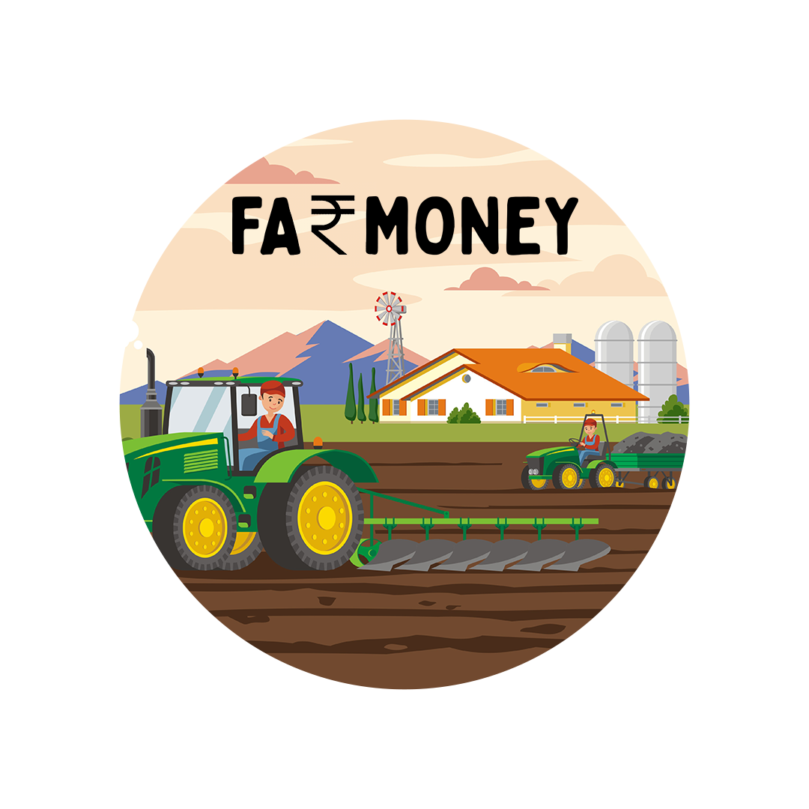
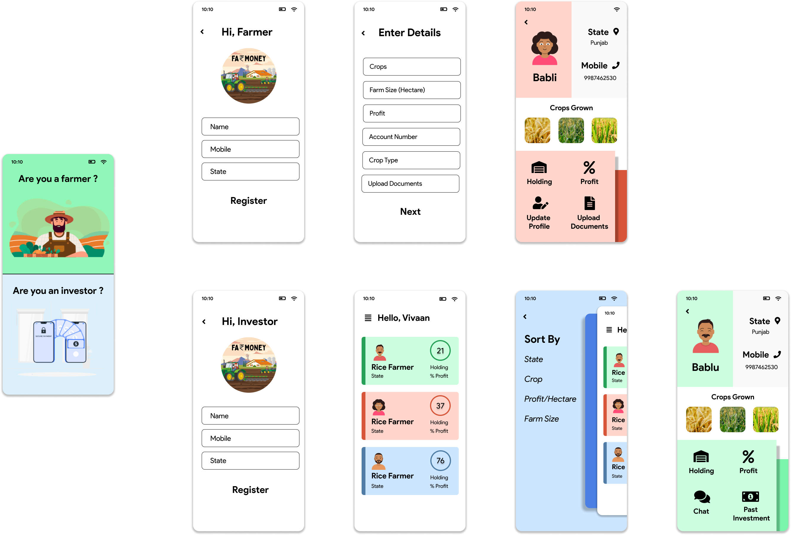

# Far_money

One bad harvest is all it takes for everything to fall apart for indian farmers and put them in vicous cycle of debt. This doesn't allow them to grow for the landlords and lenders keep exploiting them for their money. To solve all these problems and connect rural and urban India, We'd like to present Farmoney, a one-of-its-kind app which allows retail investors like us to invest in our own farmers and help them grow, while earning a sizeable profit.

### How it works
There are two sides to the App- Farmer Side and Client Side: 

Farmer Side: 
Herein, the farmer will list its farm on the platform in easy steps and then submit proof of profitability in last 1-3 years, if approved, the farmer will be listed upon the platform and will have the opportunity to get investment from plethora of investors.

Investor Side: 
The investor will register themselves on the platform and then will be open to see hundreds of farms where they can invest any portion of their money. They can filter the farmers on the basis of attributes like land size, crop type, revenue etc.

### The User Interface

### The Algorithm
Our algorithms make it easier for the investor to choose the right farm to put their money in. 
Here's a peek:

### Tech Stack
   
